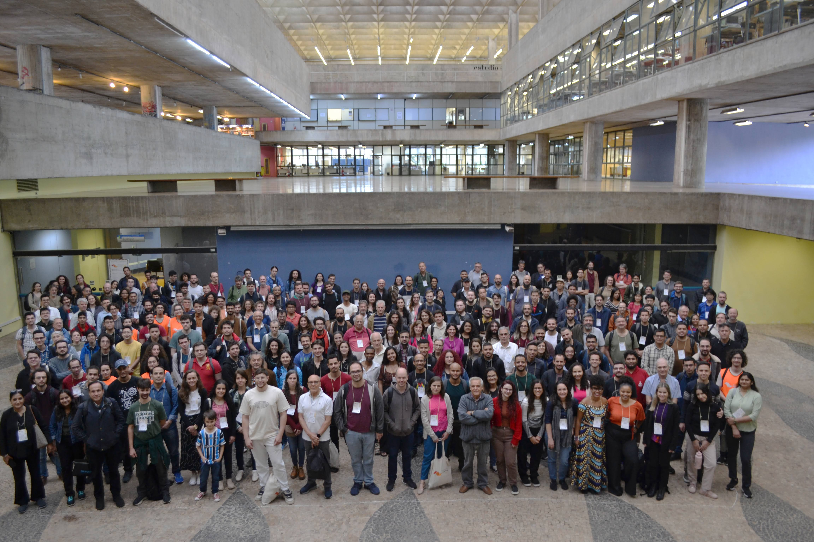
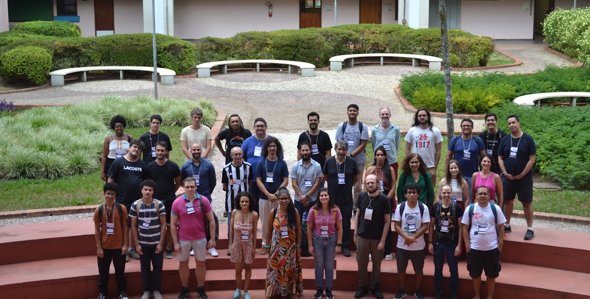
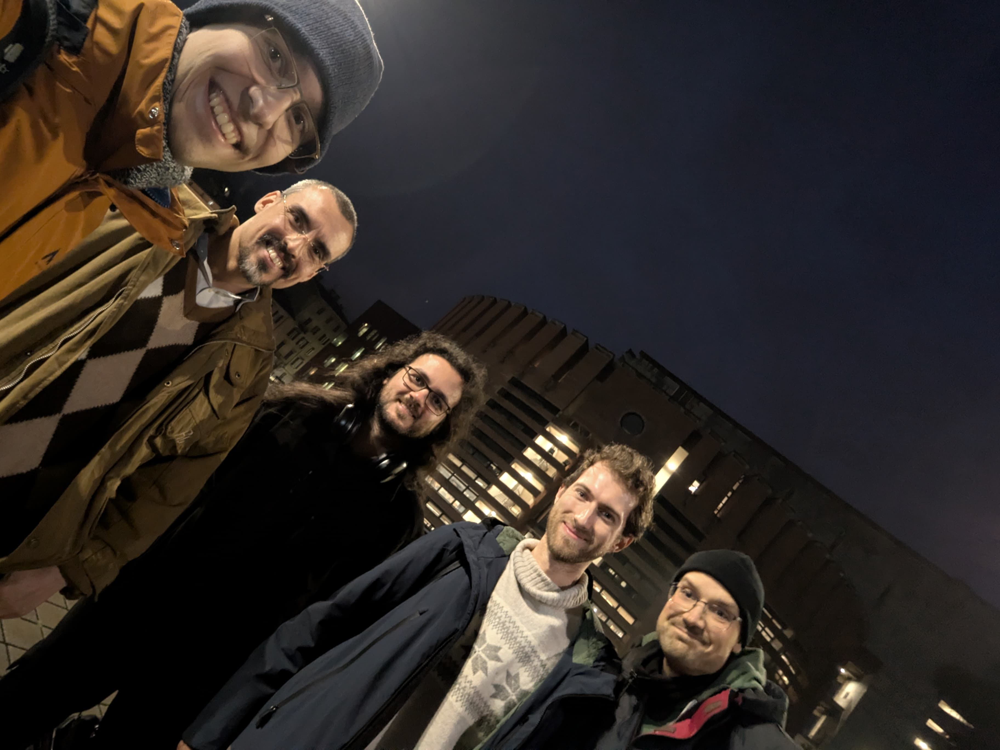
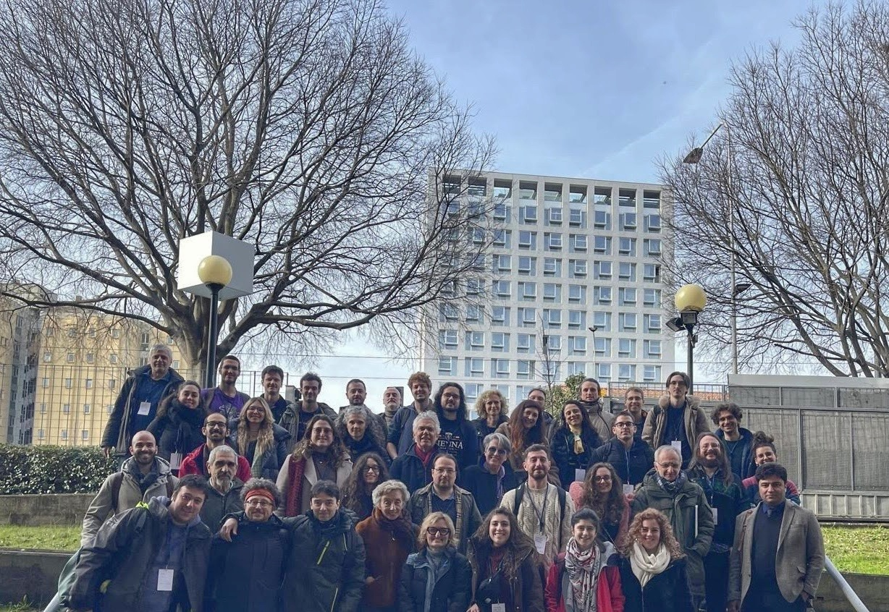
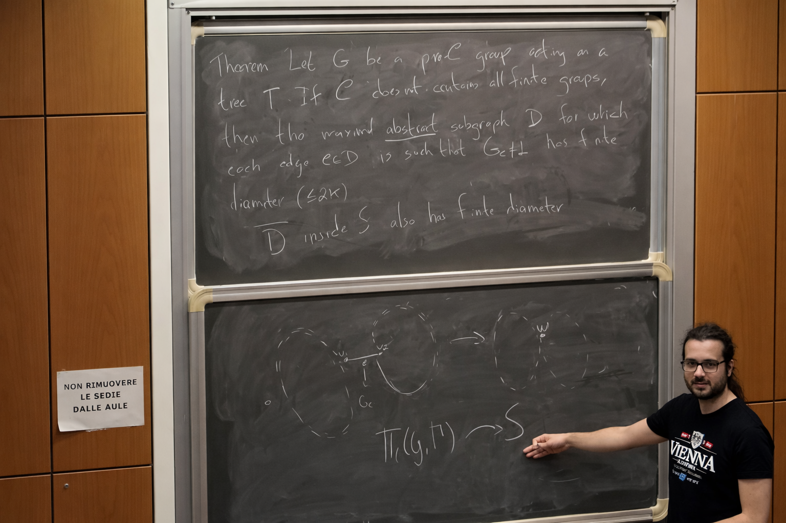

## About Me

I am a mathematician. I spent my time as a Ph.D. student at University of Brasília (UnB) under the supervision of <a href="https://www.mat.unb.br/pz">Dr. Pavel Zalesski</a> with a period at University of Milano-Bicocca under the supervision of <a href="https://www.unimib.it/thomas-stefan-weigel">Dr. Thomas Weigel</a>.

## News

- **Jun 2026:** I will start a post-doctoral project at Universidade Federal de Minas Gerais. 

## Research Interests

- Profinite groups, profinite Bass-Serre theory, geometric group theory, block theory for profinite groups.

## Papers

- **Lucas C. Lopes**, Pavel Shumyatsky & Pavel A. Zalesskii (2024) <a href="https://docs.google.com/viewer?url=https://github.com/lcorrealopes/home/raw/main/assets/files/Paper1LSZ.pdf">Profinite groups with abelian Sylow subgroups</a>, Communications in Algebra, DOI: <a href="https://doi.org/10.1080/00927872.2023.2239352">10.1080/00927872.2023.2239352</a>.

- **Lucas C. Lopes** & Pavel A. Zalesskii (2025) <a href="https://londmathsoc.onlinelibrary.wiley.com/doi/10.1112/jlms.70330">Prosoluble subgroups of the profinite completion of the fundamental group of compact 3-manifolds</a>, Journal of the London Mathematical Society, DOI: <a href="https://doi.org/10.1112/jlms.70330">10.1112/jlms.70330</a>.

- (Temporary title) Pro-*C* subgroups of the fundamental group of acylindrical profinite graphs of profinite groups (joint with P. Zalesskii): *in preparation*.

- (Temporary title) Kaplansky radical for profinite groups (joint with S. Blumer, J. Feuerpfeil, C. Quadrelli): *in preparation*.

- (Temporary title) Frattini cover of *PSL_2(q)* (joint with T. Weigel): *in preparation*.

## Writings

- My <a href="https://docs.google.com/viewer?url=https://github.com/lcorrealopes/home/raw/main/assets/files/monograph.pdf">monograph</a> on solvable groups (in portuguese).
- My <a href="https://docs.google.com/viewer?url=https://github.com/lcorrealopes/home/raw/main/assets/files/thesis.pdf">dissertation</a> on *p*-adic analytic groups (in portuguese).
- My Ph.D. thesis: Profinite groups acting acylindrically on profinite trees (*soon*).

**Profinite groups, free constructions and some Bass-Serre theory:**

These texts are some interesting parts of my personal notes written in preparation for my PhD Algebra Exam. I will upload the archives randomly. Unfortunatelly they are only in portuguese language at the time but I will upload an english version as soon as possible :)

- Part I: something about profinite groups.
- Part II: <a href="https://docs.google.com/viewer?url=https://github.com/lcorrealopes/home/raw/main/assets/files/Free-Projective.pdf">Free vs Projective Groups</a>.
- Part III: <a href="https://docs.google.com/viewer?url=https://github.com/lcorrealopes/home/raw/main/assets/files/Free product.pdf">Free Products</a>.
- Part IV: <a href="https://docs.google.com/viewer?url=https://github.com/lcorrealopes/home/raw/main/assets/files/Amalgamated product.pdf">Amalgamated Products</a>.
- Part V: something about HNN-extensions.
- Part VI: something about Bass-Serre theory.

## Book Recommendations

If you are an undergrad student, these are some good (*in my opinion*) books to construct a strong mathematical base:

- **Abstract Algebra:**
  - *Abstract Algebra* (Dummit & Foot),
  - *A Course in the Theory of Groups* (Robinson),
  - *Examples of Groups* (Weinstein),
  - *Field and Galois Theory* (Morandi).

- **Real Analysis:**
  - *Real Mathematical Analysis* (Pugh),
  - *Principles of Mathematical Analysis* (Rudin),
  - *Calculus on Manifolds* (Spivak).

- **Linear Algebra:**
  - *Linear Algebra and Its Applications* (Lax).

- **Topology:**
  - *General Topology* (Willard).

If you are interested in learn the fundamentals for the profinite Bass-Serre theory, I suggest you to follow the short sequence: 

<math display="block" xmlns="http://www.w3.org/1998/Math/MathML">
  <mrow>
    <mn>0</mn>
    <mo>→</mo>
    <mi><a href="https://link.springer.com/book/10.1007/978-3-642-61856-7">A</a></mi>
    <mo>→</mo>
    <mi><a href="https://link.springer.com/book/10.1007/978-3-642-01642-4">B</a></mi>
    <mo>→</mo>
    <mi><a href="https://link.springer.com/book/10.1007/978-3-319-61199-0">C</a></mi>
    <mo>→</mo>
    <mn>0</mn>
  </mrow>
</math>

## Teaching

- **Calculus 1: 2024-2025 at Universidade de Brasília**

## Pictures

  
  

    <strong>XXVII Escola de Álgebra</strong> 
    Universidade de São Paulo, 2024
  

  
  

    <strong>IV Workshop in Groups and Algebras</strong> 
    Universidade Federal de Minas Gerais, 2025
  

  
  

    <strong>Algebra Seminar (in the photo: Julian Feuerpfeil, Theo Zapata, me, Simone Blumer and Claudio Quadrelli)</strong> 
    Università degli Studi dell'Insubria, 2025
  

  
  

    <strong>Gruppen und topologische Gruppen</strong> 
    Università degli Studi di Firenze, 2026
  

  
  

    <strong>Algebra Seminar</strong> 
    Università degli Studi di Milano-Bicocca, 2026
  

