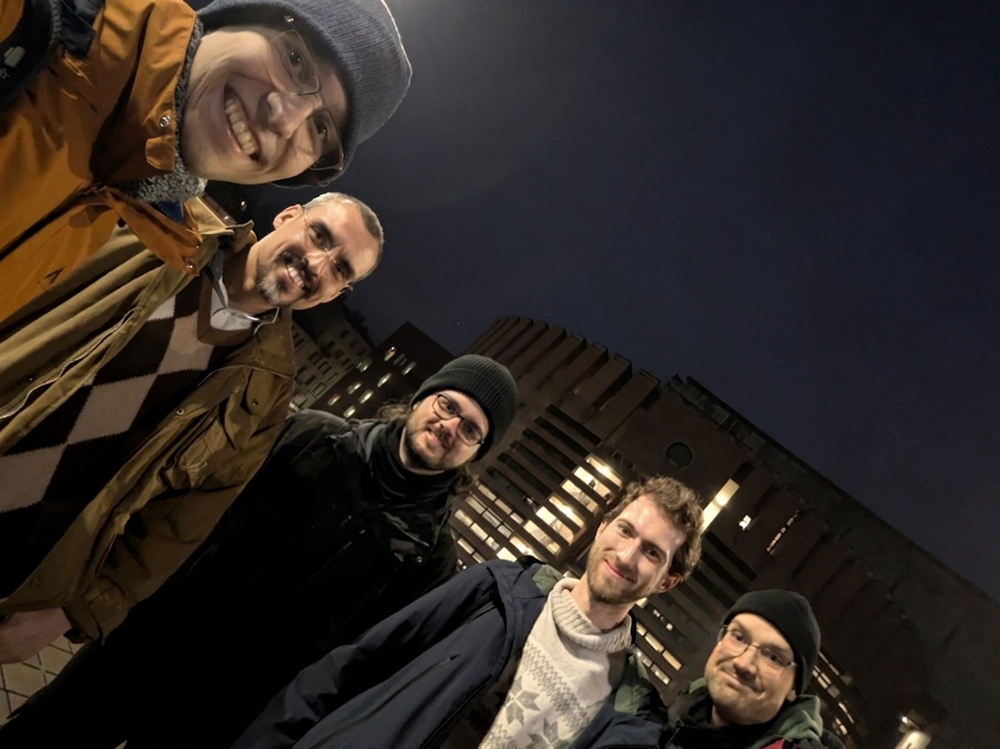
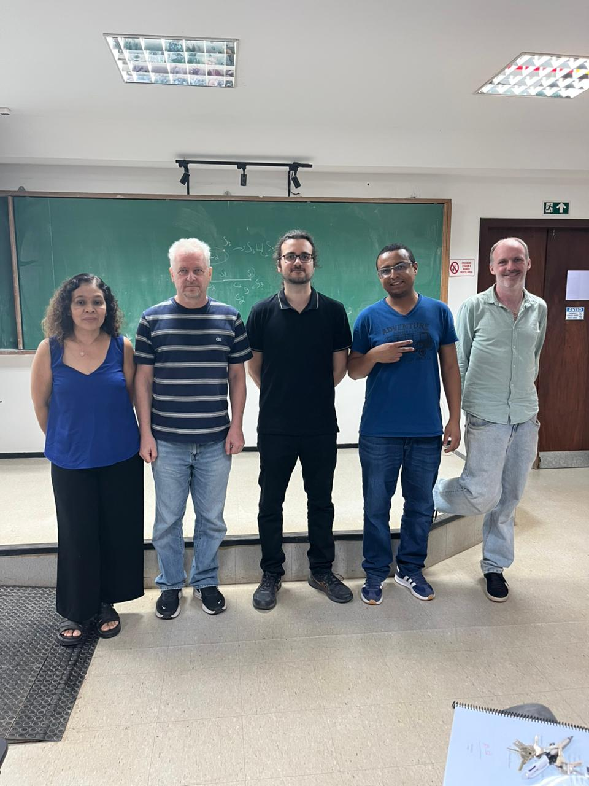

## About Me

I am a mathematician. I was a Ph.D. student at University of Brasília (UnB) under the supervision of <a href="https://www.mat.unb.br/pz">Dr. Pavel Zalesski</a> with a research period at University of Milano-Bicocca under the supervision of <a href="https://www.unimib.it/thomas-stefan-weigel">Dr. Thomas Weigel</a>. I completed my Ph.D. in April 2026. My Erdős number is 4.

Currently I am a postdoctoral researcher at Federal University of Minas Gerais. 

## Research Interests

- Profinite groups, profinite Bass-Serre theory, geometric group theory, block theory for profinite groups.

## Papers

- **Lucas C. Lopes**, Pavel Shumyatsky & Pavel A. Zalesskii (2024) <a href="https://docs.google.com/viewer?url=https://github.com/lcorrealopes/home/raw/main/assets/files/Paper1LSZ.pdf">Profinite groups with abelian Sylow subgroups</a>, **Communications in Algebra**, DOI: <a href="https://doi.org/10.1080/00927872.2023.2239352">10.1080/00927872.2023.2239352</a>.

    
<strong>Abstract</strong>

    
We extend the definition of a finite *A*-group to profinite groups and give a description of profinite *A*-groups as a triple semidirect product of two prosoluble groups with a semisimple group, extending an old result of A. M. Broshi to the profinite case. We also prove that a profinite *A*-group with finitely generated non-trivial Fitting subgroup is metabelian-by-(finite exponent). If, in addition, G is finitely generated then it is virtually metabelian polycyclic.

  

- **Lucas C. Lopes** & Pavel A. Zalesskii (2025) <a href="https://londmathsoc.onlinelibrary.wiley.com/doi/10.1112/jlms.70330">Prosoluble subgroups of the profinite completion of the fundamental group of compact 3-manifolds</a>, **Journal of the London Mathematical Society**, DOI: <a href="https://doi.org/10.1112/jlms.70330">10.1112/jlms.70330</a>.

    
<strong>Abstract</strong>

    
We describe free prosoluble subgroups of a free product of profinite groups by strengthening the theorem of Frorian Pop and answering two questions of K. Ersoy and W. Herfort. Relatively projective prosoluble groups are also described.

  

- Simone Blumer, Julian Feuerpfeil, **Lucas C. Lopes**, Claudio Quadrelli (2026+). A cohomological translation of the Kaplansky radical for profinite groups. Available on <a href="https://arxiv.org/abs/2606.31547v1">arxiv</a>.

    
<strong>Abstract</strong>

    
The Kaplansky radical of a field consists of the nonzero elements represented by every norm quadratic form in two variables. D. Kijima and M. Nishi conjectured that, for quadratic extensions, the Kaplansky radicals are related by the norm map in a manner analogous to Hilbert’s Theorem 90. Although this H-conjecture was disproved by K.J. Becher and D.B. Leep, it is known to hold for several important classes of fields. We introduce a cohomological analogue of the Kaplansky radical for arbitrary profinite groups and primes *p*, defined as the orthogonal of *H^1(G,F_p)* with respect to the cup product with itself. For absolute Galois groups, this recovers the classical Kaplansky radical when *p=2* and the *p*−radical of Dario–Engler for arbitrary *p*. We also formulate a group-theoretic analogue of the H-conjecture, proving that, for fields, it is equivalent to the original conjectural property and depends only on the maximal pro-*2*
 quotient of the absolute Galois group. We establish this property for broad classes of fields, including local and global fields, rational function fields, and all fields whose maximal pro-*p* Galois group is of elementary type. Beyond its arithmetic origins, we investigate the property for general pro-
*p* groups, proving its stability under several natural group-theoretic constructions and obtaining new examples, including generalized right-angled Artin pro-
*p* groups and fundamental pro-*p* groups of suitable graphs of groups, many of which cannot occur as maximal pro-*p* Galois groups.

  

- (Temporary title) Pro-*C* subgroups of free profinite products and profinite groups acting on profinite trees (joint with P. Zalesskii): *soon*.

- (Temporary title) Frattini cover of *PSL_2(q)* (joint with Thomas Weigel): *in preparation*.

- (Temporary title) On the Magnus property for profinite groups (joint with Geovane M. L. Andrade, Martino Garonzi, Claude Marion): *in preparation*.

- (Temporary title) On the profinite completion of graph braid groups: *in preparation*.

- (Temporary title) Block theory and profinite groups acting on profinite trees: *in preparation*.

## My coauthors 

<a href="https://www.researchgate.net/profile/Geovane-Matheus-Andrade-2">Geovane M. L. Andrade</a> (Brasília, BRA), <a href="https://sites.google.com/view/simone-blumer/">Simone Blumer</a> (Milano, ITA), <a href="https://sites.google.com/campus.unimib.it/feuerpfeil/">Julian Fuerpfeil</a> (Milano, ITA & Besançon, FRA), <a href="https://docente.unife.it/martino.garonzi">Martino Garonzi</a> (Ferrara, ITA), <a href="https://www.ime.usp.br/marion/">Claude Marion</a> (São Paulo, BRA), <a href="https://sites.google.com/view/claudioquadrelli-math/home">Claudio Quadrelli</a> (Como, ITA), <a href="https://www.mat.unb.br/pz">Pavel Zalesski</a> (Brasília, BRA), <a href="https://mat.unb.br/index.php/pessoas/docentes/57-pavel-shumyatsky">Pavel Shumyatsky</a> (Brasília, BRA), <a href="https://www.unimib.it/thomas-stefan-weigel">Thomas Weigel</a> (Milano, ITA).

## Writings

- My doctoral thesis: [Profinite groups acting acylindrically on profinite trees.](assets/files/profinite-groups-acting-acylindrically-on-profinite-trees.pdf)

## Book Recommendations

Starting your undergrad? Here are some books that shaped the beginning of my academic career:

  - *Abstract Algebra* (Dummit & Foot).
  - *Examples of Groups* (Weinstein).
  - *Field and Galois Theory* (Morandi).
  - *Principles of Mathematical Analysis* (Rudin).
  - *Real Mathematical Analysis* (Pugh).
  - *Linear Algebra and Its Applications* (Lax).
  - *General Topology* (Willard).
  - *An Introduction to Algebraic Topology* (Rotman).  

If you are interested in learn the fundamentals for the profinite Bass-Serre theory, I suggest you to follow the short sequence: 

<math display="block" xmlns="http://www.w3.org/1998/Math/MathML">
  <mrow>
    <mn>0</mn>
    <mo>→</mo>
    <mi><a href="https://link.springer.com/book/10.1007/978-3-642-61856-7">A</a></mi>
    <mo>→</mo>
    <mi><a href="https://link.springer.com/book/10.1007/978-3-642-01642-4">B</a></mi>
    <mo>→</mo>
    <mi><a href="https://link.springer.com/book/10.1007/978-3-319-61199-0">C</a></mi>
    <mo>→</mo>
    <mn>0</mn>
  </mrow>
</math>

## Teaching

- **Calculus 1: 2024-2025 at Universidade de Brasília**

## Mathematics around the world

  
XXVII Escola de Álgebra</strong> Universidade de São Paulo, 2024">
    
    

      <strong>XXVII Escola de Álgebra</strong> 
      Universidade de São Paulo
    

  

  
IV Workshop in Groups and Algebras</strong> Universidade Federal de Minas Gerais, 2025">
    
    

      <strong>IV Workshop in Groups and Algebras</strong> 
      Universidade Federal de Minas Gerais
    

  

  
Algebra Seminar (in the photo: Julian Feuerpfeil, Theo Zapata, me, Simone Blumer and Claudio Quadrelli)</strong> Università degli Studi dell'Insubria, 2025">
    
    

      <strong>Algebra Seminar</strong> 
      Università degli Studi dell'Insubria
    

  

  
Gruppen und topologische Gruppen</strong> Università degli Studi di Firenze, 2026">
    
    

      <strong>Gruppen und topologische Gruppen</strong> 
      Università degli Studi di Firenze
    

  

  
Algebra Seminar</strong> Università degli Studi di Milano-Bicocca, 2026">
    
    

      <strong>Algebra Seminar</strong> 
      Università degli Studi di Milano-Bicocca
    

  

  
PhD Thesis Defense (in the photo: Sheila Chagas, Pavel Zalesski, me, Igor Lima and John MacQuarrie)</strong> Universidade de Brasília, 2026">
    
    

      <strong>Doctoral Thesis Defense</strong> 
      Universidade de Brasília
    

  

  &times;
  
  

