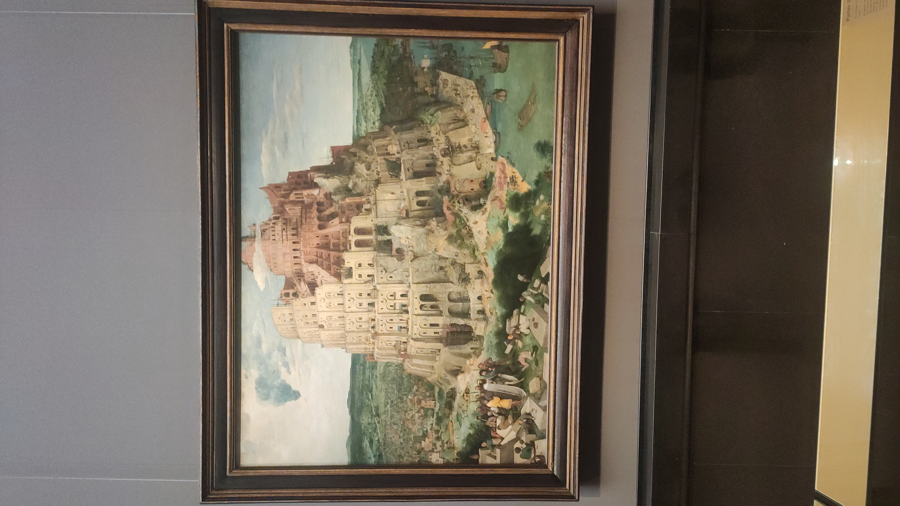
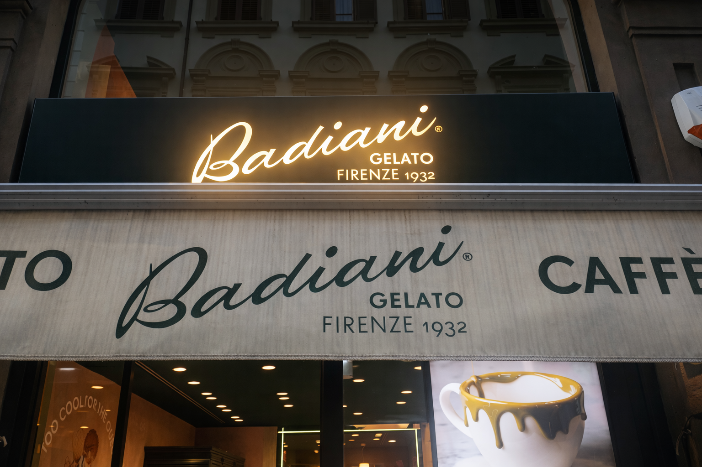
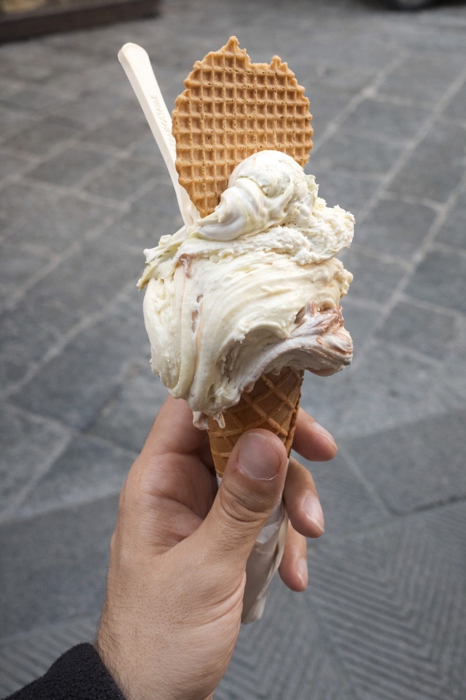
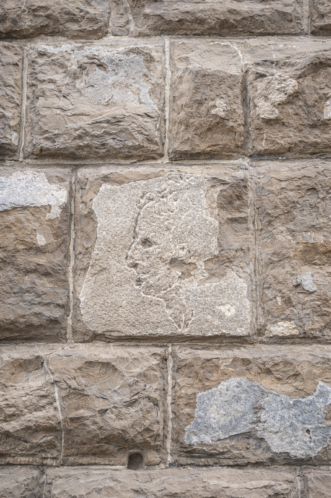
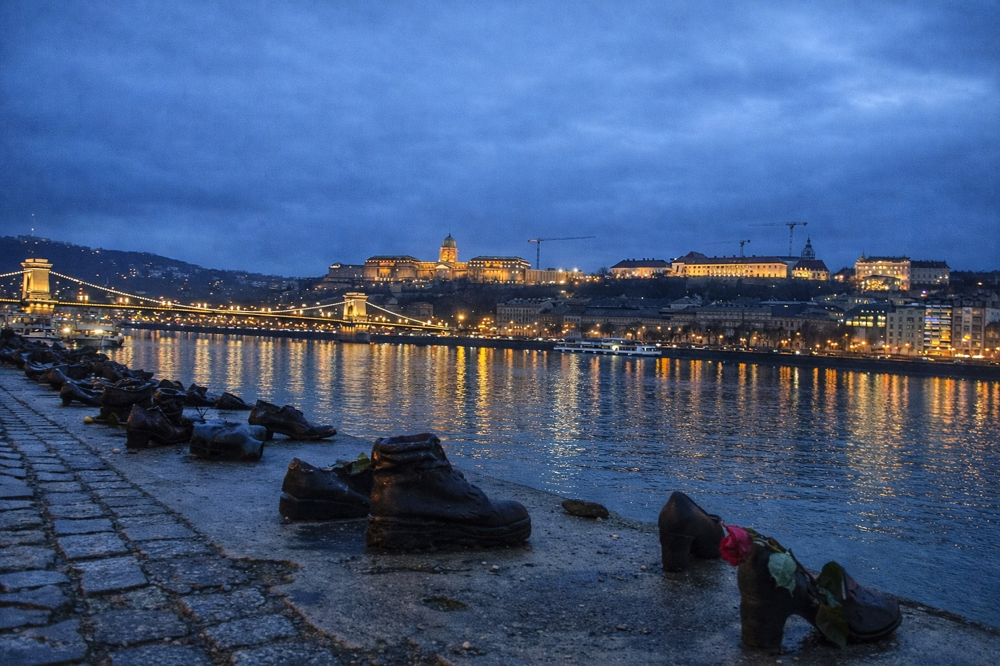

## Nice places around the world (and a little bit of history)

  **Duomo di Milano:** The construction of the Duomo di Milano began around 1380. Built almost entirely of pink-veined Candoglia marble, it took nearly six centuries to complete. This is the largest church in Italy (and Italy really has a lot of churches), except for the Vatican. In the neighborhood of the Duomo you will find a lot of quite expensive café and souvenirs (you can also find the most expensive Aperol Spritz of your life in case you drink alcohol).

    

  **Castello Sforzesco:**  The Castello Sforzesco in Milan was built way back in the 1400s by Francesco Sforza. Inside you will find Michelangelo's final unfinished work, the Rondanini Pietà (probably the castle's most famous piece). He kept chiselling away at this Virgin mourning Christ right up until a few days before he died in 1564. Honestly, it's totally worth a visit, just 5 euros and you get to see a ton of different art (seriously, trust me).

  **Bernina Express train:** I must start by saying that this is not the Hogwarts train. The Bernina Express will give you a chill ride through the Swiss Alps. You will have an insanely beautiful view. Ah, and it’s a UNESCO World Heritage Site. It’s not the cheapest trip but you should grab a window seat and just enjoy the views.

 **Wiener Staatsoper:** One of the world’s most famous opera houses, set in a very beautiful building (this pic was taken from a little raised square right near the opera, keep that tip). If you don’t want to shell out a ton or couldn’t preorder a seat, head to the side of the building where you can grab way cheaper standing-room tickets and watch the whole thing on your feet.

<!-- Adicionado max-width: 800px na div abaixo -->

<!-- Adicionado min-width: 0; em cada imagem -->

  **Kunsthistorisches Museum:**  At Kunsthistorisches Museum you will find an enormous amount of important works. Those in the photos are: De Schilderkunst, Turmbau zu Babel, Jäger im Schnee and Madonna del Rosario. Vermeer painted De Schilderkunst and loved it so much that he refused to sell it even when deeply in debt. Ah, the museum has an excellent (and beautifully architectured) café where you can have a great strudel.

    

  **Badiani:** This is my favorite gelateria in Italy, located in the heart of Firenze. I recommend you to try Buontalenti Pistacchio, La Dolcevita and Buontalenti al Caramello.

  **L'importuno di Michelangelo:** Everyone knows the main tourist attractions of Florence, especially the Basilica di Santa Croce, where the tombs of historical figures such as Galileo, Michelangelo etc., are located. But this discreet sculpture on the wall brings a peculiar story: Michelangelo supposedly carved this face into the stone while bored from listening to stories told by a man who always bothered him in that square (this is the explanation for the name).

  **Cipők a Duna-parton:** This is a poignant memorial in honor of the victims of the Second World War. The memorial consists of several pairs of shoes. At the time, shoes had significant value so they were taken from the people who were about to be executed before their bodies fell into the Danube river.

<!-- ========================================== -->
<!-- ESTRUTURA DO LIGHTBOX -->
<!-- ========================================== -->

  &times;
  
  

